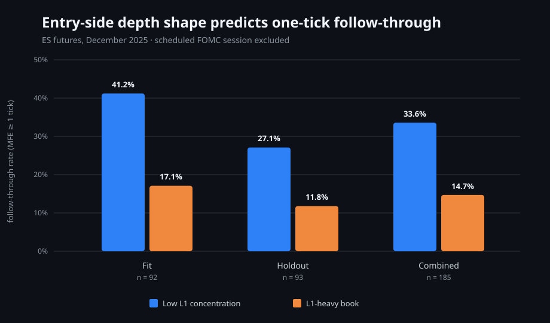
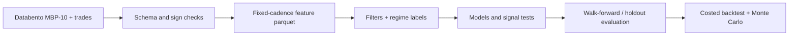

# L2 Order-Flow Signals

Research and engineering stack for testing short-horizon signals in futures Level 2 order-book data. The repository covers ingestion, filtration, feature construction, regime-aware labeling, model evaluation, falsification tests, and execution-aware backtesting; it also contains the code and frozen evidence for a real depth-shape effect in ES.

## Evidence first: depth shape predicts follow-through

The strongest result in this repository is `depth_shape_ratio`: level-one size divided by cumulative L1-L5 size on the side an entry would consume—ask depth for longs and bid depth for shorts.

`depth_shape_ratio = L1 size / (L1 + L2 + L3 + L4 + L5 size)`

Lower values mean a thin best quote relative to displayed depth behind it. On 185 ES entries from eight usable December 2025 sessions, low entry-side concentration was associated with materially more one-tick follow-through.



### Tercile check

The initial `qcut` check was monotone: low ratio had the highest follow-through, the middle tercile was intermediate, and high ratio had the lowest. The low-to-high endpoint spread was approximately 25 percentage points.

| Entry-side ratio tercile | Book shape | One-tick follow-through | Difference from low tercile |
|---|---|---|---:|
| Low | Thin L1 relative to L1-L5 | Highest | reference |
| Middle | Intermediate concentration | Between the endpoints | — |
| High | L1-heavy | Lowest | about -25 pp |

The original per-tercile cell counts were not retained in the committed artifact, so they are not reconstructed with invented precision. The exact fit/holdout rates were preserved:

### Time split and day check

| Cohort | Entries | Low-concentration entries | Follow-through | L1-heavy entries | Follow-through | Spread |
|---|---:|---:|---:|---:|---:|---:|
| Fit: first 6 sessions | 92 | 51 | 41.2% | 41 | 17.1% | +24.1 pp |
| Holdout: next 2 sessions | 93 | 59 | 27.1% | 34 | 11.8% | +15.4 pp |
| Combined, excluding FOMC | 185 | 110 | 33.6% | 75 | 14.7% | +18.9 pp |

The relationship appeared in seven of eight usable days. The scheduled FOMC session inverted and was excluded under a fixed event rule; December 1 had only 10 entries and was too small to interpret. Holdout lift shrank by 8.7 points, so the result is presented as a useful rejection filter—not a finished trading strategy.

The analysis is implemented in [`scripts/run_book_shape_analysis.py`](scripts/run_book_shape_analysis.py), feature construction is in [`scripts/build_dataset.py`](scripts/build_dataset.py), schema checks are in [`scripts/verify_mbp10_schema.py`](scripts/verify_mbp10_schema.py), and the frozen result is [`configs/gate_dsr_v1.json`](configs/gate_dsr_v1.json).

## System architecture

The pipeline is organized as ingestion → filtration → feature extraction → regime-aware labeling → model training and evaluation → execution-aware backtesting.



### Data sources

The research path consumes trade prints and Level 2 depth across multiple price levels. `scripts/build_dataset.py` reconstructs top-of-book state, per-level sizes, cumulative depth, imbalance, depth slope, sweep cost, and depth-shape ratios into partitioned feature parquet files.

Licensed Databento files are not committed. The repository therefore separates a runnable synthetic smoke path from the real-data commands that require local MBP-10 data.

### Filtration layer

The filtration layer removes or downweights stale quotes, crossed or locked markets, mechanical bursts, wide-spread states, and low-information events. Sign conventions and schema invariants are checked before any backtest because an inverted aggressor sign can produce a plausible-looking but directionally wrong result.

### Level 2 order-book modeling

The feature layer models liquidity across depth levels to measure shape, imbalance, replenishment, absorption, sweep cost, and liquidity consumption. Entry-side alignment is explicit: features are mapped to the side the candidate trade would consume before they are compared with forward outcomes.

### Regime segmentation

Liquidity, volatility, spread, and event regimes are analyzed separately to avoid treating non-stationary market behavior as one population. Scheduled macro sessions are handled through fixed eligibility rules rather than removed after inspecting PnL.

### Distributional modeling

The model stack includes classification and distributional or quantile-style evaluation rather than relying on a single point forecast. This supports asymmetric decisions, tail inspection, and regime-conditioned thresholds while keeping feature, label, and execution logic modular.

### Evaluation and backtesting

Evaluation includes chronological fit/holdout splits, day-level consistency checks, feature terciles, Pearson and Spearman diagnostics, macro F1, drawdown analysis, execution-cost modes, delay robustness, outlier kill tests, and trade-level Monte Carlo. Negative and shrinking results are retained; `INACTIVE_FEATURES.md` records discarded ideas instead of silently deleting them.

## Run it

### Fresh-clone smoke test

This path needs no market-data files and exercises synthetic quote generation, feature construction, forward labels, chronological fitting, and holdout evaluation:

Clone the repository, then run the smoke path with the virtual environment's
interpreter directly (no shell activation required):

```bash
git clone https://github.com/jjliu2008/l2-orderflow-signals.git
cd l2-orderflow-signals
python -m venv .venv
# macOS / Linux
.venv/bin/python -m pip install -r requirements-demo.txt
.venv/bin/python scripts/run_toy_showcase.py
```

```powershell
# Windows PowerShell (after cloning and entering the repository)
py -m venv .venv
.\.venv\Scripts\python.exe -m pip install -r requirements-demo.txt
.\.venv\Scripts\python.exe scripts\run_toy_showcase.py
```

Expected final line:

```text
Smoke pipeline complete: synthetic data -> features -> labels -> model -> holdout metrics
```

### Real-data research path

Install the full dependency set:

```bash
python -m pip install -r requirements.txt
```

The following stages require files that cannot be shipped in this public repository:

| Stage | Command | Required local input |
|---|---|---|
| Dataset construction | `python scripts/run_build_dataset.py` | Databento MBP-10 and trades under `data/raw/` |
| Depth-shape study | `python scripts/run_book_shape_analysis.py --parquet-root data/processed --out artifacts/book_shape_analysis.json` | Processed feature parquet plus candidate-trade CSVs |
| Model training | `python scripts/run_train_model.py` | `data/raw/` or `data/processed/`; the script prompts for paths |
| Backtest | `python scripts/run_backtest.py` | A trained artifact at `artifacts/hgb_combo_model.joblib`, or `BT_MODEL_PATH` |
| Dashboard | `streamlit run research_dashboard/app.py` | Research artifacts produced by the preceding stages |

`data/` and `artifacts/` are intentionally gitignored because they contain licensed source data, large derived files, and run outputs. The code, validation specification, tests, and non-proprietary aggregate findings remain public.

## Repository map

| Path | Purpose |
|---|---|
| `scripts/build_dataset.py` | Raw MBP-10/trade ingestion and feature parquet construction |
| `src/feature_engineering.py` | Reusable price, depth, order-flow, volatility, and absorption features |
| `src/labels.py` | Row- and time-horizon forward labels with symbol-safe alignment |
| `scripts/run_book_shape_analysis.py` | Entry-side joins, terciles, correlations, and follow-through analysis |
| `scripts/run_feature_promotion_test.py` | Cross-run feature promotion criteria and coverage checks |
| `scripts/run_backtest.py` | Model-driven replay with configurable execution assumptions |
| `scripts/run_trade_monte_carlo.py` | Trade-order resampling, cost modes, drawdown, and positive-EV probabilities |
| `research_dashboard/` | Streamlit views for regimes, filters, replays, outliers, and Monte Carlo |
| `configs/` | Frozen experiment and validation specifications |
| `tests/` | Label, feature, model, orchestration, and Monte Carlo checks |

## Scope of the result

The depth-shape study predicts whether a candidate moves at least one tick in its intended direction. It did not improve payoff magnitude among winners, and it does not establish net profitability after fees, latency, slippage, or queue position. What it does establish is a real, time-split order-book effect with a visible failure regime and an implementation that can be inspected end to end.

